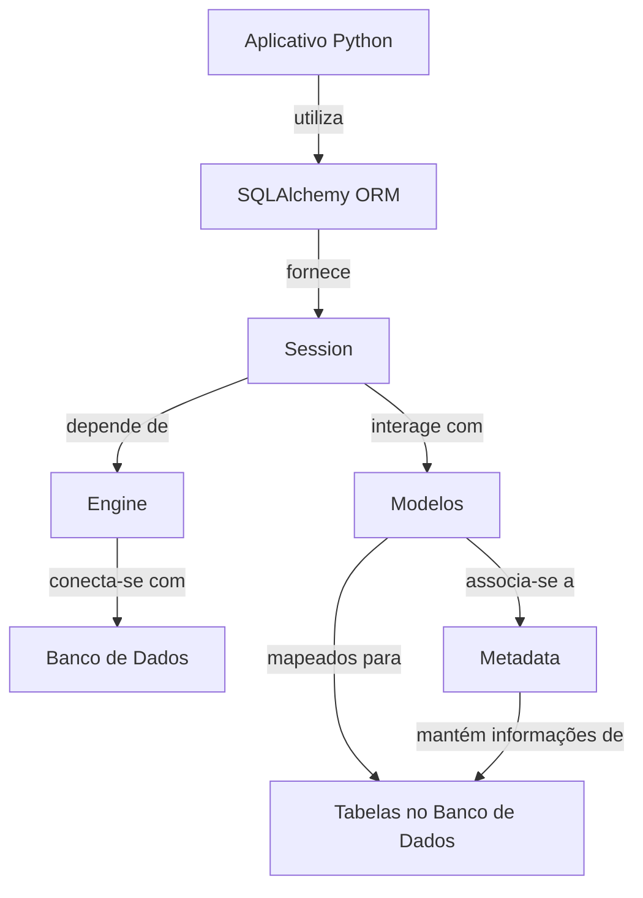

# Configurando o Banco de Dados e Gerenciando Migrações com Alembic

---
Objetivos dessa aula:

-  Introdução ao SQLAlchemy e Alembic
-  Instalando SQLAlchemy e Alembic
-  Configurando e criando o banco de dados
-  Criando e localizando tabelas utilizando SQLAlchemy
-  Testando a criação de tabelas
-  Gerenciando migrações do banco de dados com Alembic

??? tip "Caso prefira ver a aula em vídeo"
	Esse aula ainda não está disponível em formato de vídeo, somente em texto!

	

[Aula :fontawesome-brands-youtube:](#){ .md-button }
[Slides :fontawesome-solid-file-powerpoint:](https://github.com/dunossauro/fastapi-do-zero/blob/main/slides/pdf/aula_04.pdf){ .md-button }
[Código :fontawesome-solid-code:](https://github.com/dunossauro/fastapi-do-zero/tree/main/codigo_das_aulas/04/){ .md-button }

---

Com os endpoints da nossa API já estabelecidos, estamos, por ora, utilizando um banco de dados simulado, armazenando uma lista em memória. Nesta aula, iniciaremos o processo de configuração do nosso banco de dados real. Nossa agenda inclui a instalação do SQLAlchemy, a definição do modelo de usuários, e a execução da primeira migração com o Alembic para um banco de dados evolutivo.


## [WIP] ORM

> Uma introdução ao ORM, explicar sua relação com o banco de dados.

### SQLAlchemy

> Uma introdução ao SQLAlchemy
> Instalação

```shell title="$ Execução no terminal!"
poetry add sqlalchemy
```

#### Modelo de dados

```python title="fast_zero/models.py" linenums="1"
from sqlalchemy.orm import DeclarativeBase
from sqlalchemy.orm import Mapped
from sqlalchemy.orm import mapped_column


class Base(DeclarativeBase):
    pass


class User(Base):
    __tablename__ = 'users'

    id: Mapped[int] = mapped_column(primary_key=True)
    username: Mapped[str]
    password: Mapped[str]
    email: Mapped[str]
```

#### O uso básico do SQLAlchemy



> Discutir todos esse componentes Engine, Session, Base

```python title="tests/test_db.py" linenums="1"
from sqlalchemy import create_engine, select
from sqlalchemy.orm import Session

from fast_zero.models import Base, User


def test_create_user():
    engine = create_engine('sqlite:///:memory:')
    Base.metadata.create_all(engine)

    with Session(engine) as session:
        new_user = User(
            username='alice', password='secret', email='teste@test'
        )
        session.add(new_user)
        session.commit()

        user = session.scalar(select(User).where(User.username == 'alice'))

		assert user.username == 'alice'

    Base.metadata.drop_all(engine)
```

> Session e os seus métodos scalar, add, commit

> explicar o `select`e o método where


#### Simplificando com fixtures

```py title="tests/conftest.py" hl_lines="13-17"
# ...
from sqlalchemy import create_engine
from sqlalchemy.orm import Session

from fast_zero.app import app
from fast_zero.models import Base

# ...


@pytest.fixture
def session():
    engine = create_engine('sqlite:///:memory:')
    Base.metadata.create_all(engine)
    with Session(engine) as _session:
        yield _session
    Base.metadata.drop_all(engine)
```

```py title="tests/test_db.py"" linenums="1"
from sqlalchemy import select

from fast_zero.models import User


def test_create_user(session):
    new_user = User(
        username='alice', password='secret', email='teste@test'
    )

    session.add(new_user)
    session.commit()

    user = session.scalar(select(User).where(User.username == 'alice'))

    assert user.username == 'alice'
```

## [WIP] Configuração do ambiente do banco de dados

> Uma introdução

### 12 fatores

Uma boa prática no desenvolvimento de aplicações é separar as configurações do código. Configurações, como credenciais de banco de dados, são propensas a mudanças entre ambientes diferentes (como desenvolvimento, teste e produção). Misturá-las com o código pode tornar o processo de mudança entre esses ambientes complicado e propenso a erros.

??? tip "Caso queira saber mais sobre 12 fatores"
	Temos uma live focada nesse assunto com a participação especial do [Bruno Rocha](https://twitter.com/rochacbruno){:target="_blank"}

	

	[:fontawesome-brands-youtube: Link direto](https://www.youtube.com/watch?v=DA-hOskxOxE){ .md-button }

Além disso, expor credenciais de banco de dados e outras informações sensíveis no código-fonte é uma prática de segurança ruim. Se esse código fosse comprometido, essas informações poderiam ser usadas para acessar e manipular seus recursos.

Por isso, usaremos o `pydantic-settings` para gerenciar nossas configurações de ambiente. A biblioteca permite que você defina configurações em arquivos separados ou variáveis de ambiente e acesse-as de uma maneira estruturada e segura em seu código.

```shell title="$ Execução no terminal!"
poetry add pydantic-settings
```

Isso está alinhado com a metodologia dos 12 fatores, um conjunto de melhores práticas para desenvolvimento de aplicações modernas. O terceiro fator, "Config", afirma que as configurações que variam entre os ambientes devem ser armazenadas no ambiente e não no código.

Por fim, configuraremos nosso banco de dados. Primeiro, criaremos um novo arquivo chamado `settings.py` dentro do diretório `fast_zero`. Aqui, usaremos o Pydantic para criar uma classe `Settings` que irá pegar as configurações do nosso arquivo `.env`. Neste arquivo, a classe `Settings` é definida como:

```python title="fast_zero/settings.py"
from pydantic_settings import BaseSettings, SettingsConfigDict


class Settings(BaseSettings):
    model_config = SettingsConfigDict(
        env_file='.env', env_file_encoding='utf-8'
    )

    DATABASE_URL: str
```

Agora, definiremos o `DATABASE_URL` no nosso arquivo de ambiente `.env`. Crie o arquivo na raiz do projeto e adicione a seguinte linha:

```shell title=".env"
DATABASE_URL="sqlite:///database.db"
```

Com isso, quando a classe `Settings` for instanciada, ela irá automaticamente carregar as configurações do arquivo `.env`.

Finalmente, adicione o arquivo de banco de dados, `database.db`, ao `.gitignore` para garantir que não seja incluído no controle de versão. Adicionar informações sensíveis ou arquivos binários ao controle de versão é geralmente considerado uma prática ruim.

```shell title="$ Execução no terminal!"
echo 'database.db' >> .gitignore
```

## [WIP] Migrações

??? tip "Caso nunca tenha trabalhado com Migrações"
	Temos uma live de Python focada nesse assunto em específico

	

	[:fontawesome-brands-youtube: Link direto](https://youtu.be/yQtqkq9UkDA){ .md-button }


### Alembic

> Uma introdução

```shell title="$ Execução no terminal!"
poetry add alembic
```

> Iniciando as migrações

```shell title="$ Execução no terminal!"
alembic init migrations
```

Com isso, a estrutura do nosso projeto sofre algumas alterações e novos arquivos são criados:


```{.plaintext hl_lines="3 10-14" .no-copy}
.
├── .env
├── alembic.ini
├── fast_zero
│  ├── __init__.py
│  ├── app.py
│  ├── models.py
│  ├── schemas.py
│  └── settings.py
├── migrations
│  ├── env.py
│  ├── README
│  ├── script.py.mako
│  └── versions
├── poetry.lock
├── pyproject.toml
├── README.md
└── tests
   ├── __init__.py
   ├── conftest.py
   ├── test_app.py
   └── test_db.py
```

No arquivo `alembic.ini`: ficam as configurações gerais das nossas migrações. Na pasta `migrations` foram criados um arquivo chamado `env.py`, esse arquivo é responsável por como as migrações serão feitas e o arquivo `script.py.mako` é um template para as novas migrações.

### Criando uma migração automática

Com o Alembic devidamente instalado e iniciado, agora é o momento de gerar nossa primeira migração. Mas, antes disso, precisamos garantir que o Alembic consiga acessar nossas configurações e modelos corretamente. Para isso, faremos algumas alterações no arquivo `migrations/env.py`.

Neste arquivo, precisamos:

1. Importar as `Settings` do nosso arquivo `settings.py` e a `Base` dos nossos modelos.
2. Configurar a URL do SQLAlchemy para ser a mesma que definimos em `Settings`.
3. Verificar a existência do arquivo de configuração do Alembic e, se presente, lê-lo.
4. Definir os metadados de destino como `Base.metadata`, que é o que o Alembic utilizará para gerar automaticamente as migrações.

O arquivo `migrations/env.py` modificado ficará assim:

```python title="migrations/env.py"
# ...
from alembic import context
from fast_zero.settings import Settings
from fast_zero.models import Base

config = context.config
config.set_main_option('sqlalchemy.url', Settings().DATABASE_URL)

if config.config_file_name is not None:
    fileConfig(config.config_file_name)

target_metadata = Base.metadata

# ...
```

Feitas essas alterações, estamos prontos para gerar nossa primeira migração automática. O Alembic é capaz de gerar migrações a partir das mudanças detectadas nos nossos modelos do SQLAlchemy.

Para criar a migração, utilizamos o seguinte comando:

```shell title="$ Execução no terminal!"
alembic revision --autogenerate -m "create users table"
```

Este comando instrui o Alembic a criar uma nova revisão de migração no diretório `migrations/versions`. A revisão gerada conterá os comandos SQL necessários para aplicar a migração (criar a tabela de usuários) e para reverter essa migração, caso seja necessário.

### Analisando a migração automática

```markdown
- [ ] Melhorar o texto e os commandos envolvendo o `sqlite3`. Não contar que pessoas tenham experiências anteriores com sqlite
  - [ ] Explicar que o sqlite3 é um shell
  - [ ] Explicar o que faz o comando `.schema`
  - [ ] Explicar o que faz o comando `.exit`
```

Ao criar uma migração automática com o Alembic, um arquivo é gerado dentro da pasta `migrations/versions`. O nome deste arquivo começa com um ID de revisão (um hash único gerado pelo Alembic), seguido por uma breve descrição que fornecemos no momento da criação da migração, neste caso, `create_users_table`.

Vamos analisar o arquivo de migração:

```{.python title="migrations/versions/e018397cecf4_create_users_table.py" .no-copy}
"""create users table

Revision ID: e018397cecf4
Revises:
Create Date: 2023-07-13 03:43:03.730534

"""
from typing import Sequence, Union

from alembic import op
import sqlalchemy as sa


# revision identifiers, used by Alembic.
revision: str = 'e018397cecf4'
down_revision: Union[str, None] = None
branch_labels: Union[str, Sequence[str], None] = None
depends_on: Union[str, Sequence[str], None] = None


def upgrade() -> None:
    # ### commands auto generated by Alembic - please adjust! ###
    op.create_table('users',
    sa.Column('id', sa.Integer(), nullable=False),
    sa.Column('username', sa.String(), nullable=False),
    sa.Column('password', sa.String(), nullable=False),
    sa.Column('email', sa.String(), nullable=False),
    sa.PrimaryKeyConstraint('id')
    )
    # ### end Alembic commands ###


def downgrade() -> None:
    # ### commands auto generated by Alembic - please adjust! ###
    op.drop_table('users')
    # ### end Alembic commands ###
```

Esse arquivo descreve as mudanças a serem feitas no banco de dados. Ele usa a linguagem core do SQLAlchemy, que é mais baixo nível que o ORM. As funções `upgrade` e `downgrade` definem, respectivamente, o que fazer para aplicar e para desfazer a migração. No nosso caso, a função `upgrade` cria a tabela 'users' com os campos que definimos em `fast_zero/models.py`e a função `downgrade` a remove.

Apesar desta migração ter sido criada, ela ainda não foi aplicada ao nosso banco de dados. No entanto, o Alembic já criou um arquivo `database.db`, conforme especificamos no arquivo `.env` que foi lido pela classe `Settings` do Pydantic. Além disso, ele criou uma tabela `alembic_version` no banco de dados para controlar as versões das migrações que foram aplicadas.

??? tip "Caso não tenha o SQLite instalado na sua máquina:"

    ```shell title="Arch"
    pacman -S sqlite
    ```

    ```shell title="Debian/Ubuntu"
    sudo apt install sqlite3
    ```

    ```shell title="Mac"
    brew install sqlite
    ```

    ```shell title="Windows"
    winget install --id SQLite.SQLite
    ```


```shell title="$ Execução no terminal!"
sqlite3 database.db
```

```{.console .no-copy}
SQLite version 3.42.0 2023-05-16 12:36:15
Enter ".help" for usage hints.
sqlite> .schema
CREATE TABLE alembic_version (
	version_num VARCHAR(32) NOT NULL,
	CONSTRAINT alembic_version_pkc PRIMARY KEY (version_num)
);
sqlite> .exit
```

Para aplicar as migrações, usamos o comando `upgrade` do CLI Alembic. O argumento `head` indica que queremos aplicar todas as migrações que ainda não foram aplicadas:

```shell title="$ Execução no terminal!"
alembic upgrade head
```

```{.console .no-copy}
INFO  [alembic.runtime.migration] Context impl SQLiteImpl.
INFO  [alembic.runtime.migration] Will assume non-transactional DDL.
INFO  [alembic.runtime.migration] Running upgrade  -> e018397cecf4, create users table
```

Agora, se examinarmos nosso banco de dados novamente, veremos que a tabela users foi criada:

```shell title="$ Execução no terminal!"
sqlite3 database.db
```

```{.console .no-copy}
SQLite version 3.42.0 2023-05-16 12:36:15
Enter ".help" for usage hints.
sqlite> .schema
CREATE TABLE alembic_version (
	version_num VARCHAR(32) NOT NULL,
	CONSTRAINT alembic_version_pkc PRIMARY KEY (version_num)
);
CREATE TABLE users (
	id INTEGER NOT NULL,
	username VARCHAR NOT NULL,
	password VARCHAR NOT NULL,
	email VARCHAR NOT NULL,
	PRIMARY KEY (id)
);
sqlite> .exit
```

Finalmente, lembre-se de que todas essas mudanças que fizemos só existem localmente no seu ambiente de trabalho até agora. Para que sejam compartilhadas com outras pessoas, precisamos fazer commit dessas mudanças no nosso sistema de controle de versão.

## [OK] Commit

Primeiro, verificaremos o status do nosso repositório para ver as mudanças que fizemos:

```shell title="$ Execução no terminal!"
git status
```

Você verá uma lista de arquivos modificados ou adicionados. As alterações devem incluir os arquivos de migração que criamos, bem como quaisquer alterações que fizemos em nossos arquivos de modelo e configuração.

Em seguida, adicionaremos todas as mudanças ao próximo commit:

```shell title="$ Execução no terminal!"
git add .
```

Agora, estamos prontos para fazer o commit das nossas alterações. Escreveremos uma mensagem de commit que descreve as mudanças que fizemos:

```shell title="$ Execução no terminal!"
git commit -m "Adicionada a primeira migração com Alembic. Criada tabela de usuários."
```

Finalmente, enviaremos as mudanças para o repositório remoto:

```shell title="$ Execução no terminal!"
git push
```

E pronto! As mudanças que fizemos foram salvas no histórico do Git e agora estão disponíveis no git.


## [OK] Conclusão

Nesta aula, demos passos significativos para preparar nosso projeto FastAPI para interagir com um banco de dados. Começamos definindo nosso primeiro modelo de dados, o `User`, utilizando o SQLAlchemy. Além disso, conforme as práticas de Desenvolvimento Orientado por Testes (TDD), implementamos um teste para assegurar que a funcionalidade de criação de um novo usuário no banco de dados esteja operando corretamente.

Avançamos para configurar o ambiente de desenvolvimento, onde estabelecemos um arquivo `.env` para armazenar nossa `DATABASE_URL` e ajustamos o SQLAlchemy para utilizar essa URL. Complementarmente, incluímos o arquivo do banco de dados ao `.gitignore` para evitar que seja rastreado pelo controle de versão.

Na última parte desta aula, focamos na instalação e configuração do Alembic, uma ferramenta de migração de banco de dados para SQLAlchemy. Usando o Alembic, criamos nossa primeira migração que, automaticamente, gera o esquema do banco de dados a partir dos nossos modelos SQLAlchemy.

Com esses passos, nosso projeto está bem encaminhado para começar a persistir dados. Na próxima aula, avançaremos para a fase crucial de conectar o SQLAlchemy aos endpoints do nosso projeto. Isso permitirá a realização de operações de CRUD nos nossos usuários diretamente através da API.
